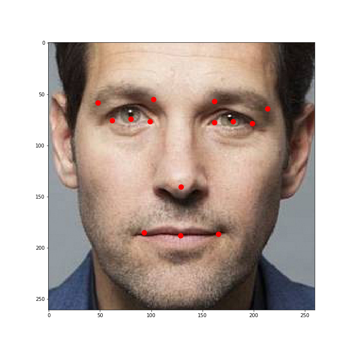

`detection.py` script provides a simple CNN model (VGG-like), which is able to detect 14 main facepoints on RGB image, 
and helper functions so as to check model performance.
- MSE on train dataset is 2.5137
- MSE on test dataset is 5.6452

## Usage:
1. Download public data (train dataset) [here](https://cloud.mail.ru/public/2w7S/YqfYiu14X) and unzip it.
2. Execute `sudo python3 run_tests.py public_data`
3. Wait until model is evaluated and get information about error. 
This may require up to 15 minutes based on performance of your machine. External GPU is recommended.

## Example of facepoints detection

